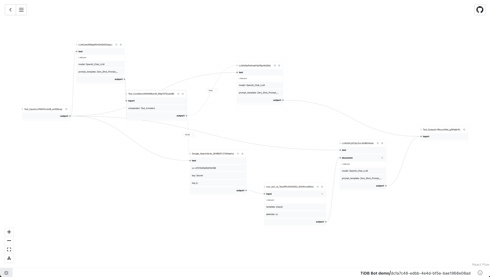

# LinguFlow UI



LinguFlow UI is a low-code application builder powered by LinguFlow, designed to assist you in rapidly prototyping LLM applications, combining them into workflows, and interacting with them to accomplish tasks. It is built on top of the LinguFlow framework.

> [!WARNING]
> LinguFlow UI is currently under active development and we are iterating quickly. Kindly consider that we may introduce breaking changes in the releases during the upcoming weeks, and also the `README` might be outdated. We'll update the `README` as soon as we stabilize the API.

## Development Setup

### Prerequisites

- [Node.js](https://nodejs.org/en) >= v19
- [Yarn](https://yarnpkg.com/getting-started/install) >= v1.12

### Local Development

To contribute to LinguFlow, you can setup a local environment with the following commands:

```bash
# Clone LinguFlow repo
git clone https://github.com/pingcap/LinguFlow.git

# Navigate to project directory
cd LinguFlow

# Install dependencies
yarn

# Build and run local dev server
# Note: Initial build will take some time
yarn dev
```

### Production Build

```bash
yarn gen:api

yarn build
```

## Contributing

### Branch Naming

The naming convention of branches is `{prefix}/{description}`

- **feat**: features development such as feat/auto-saving
- **fix**, **hotfix**: bug fix, such as fix/username, hotfix/typos
- **refine**, **polish**: UI polish or refine of logic implementation, such as polish/debug, refine/api-client
- **chore**, **docs** and other cases, such as chore/readme, docs/overview

### Commit Message

We use [Conventional Commits](https://www.conventionalcommits.org/en/v1.0.0/) as a unified writing specification for commit messages.

### PR Writing Specification

- What problem does this PR solve (related issues)?
- What is changed and how does it work?
- Checklist
- Does this PR introduce a UI change? (screen shots）
