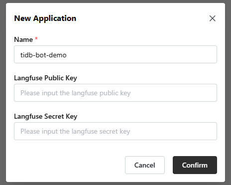
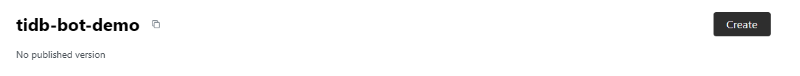
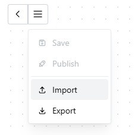
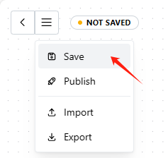
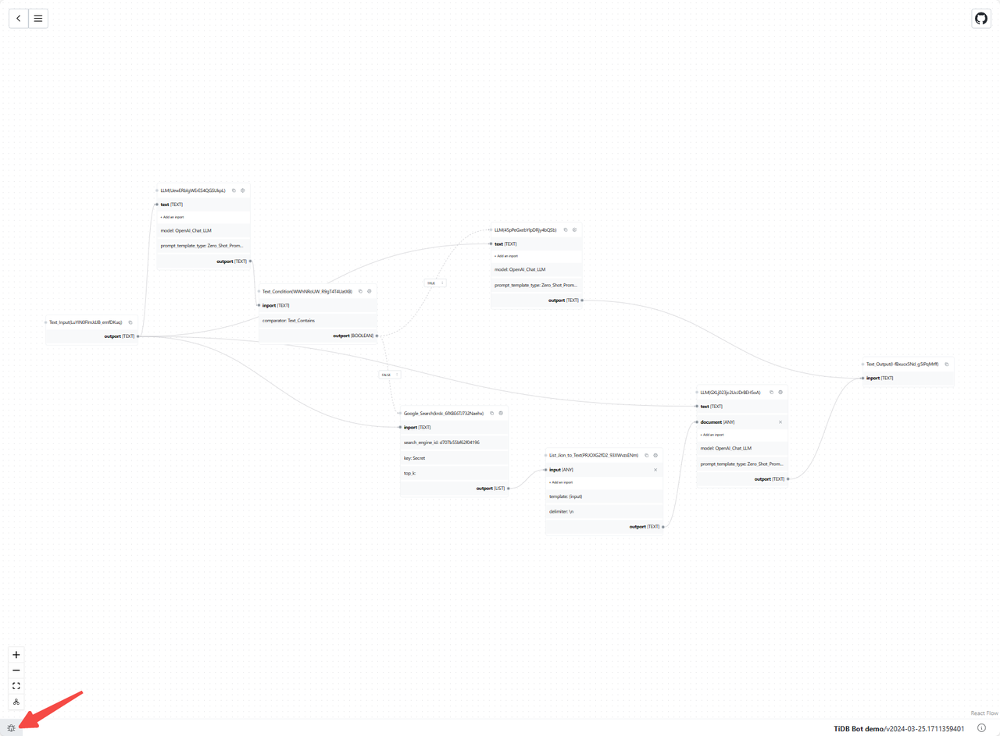
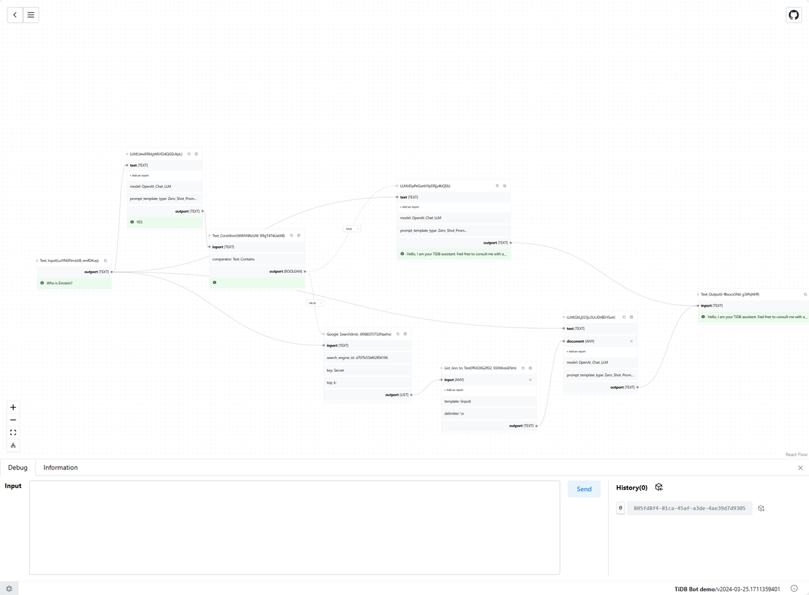
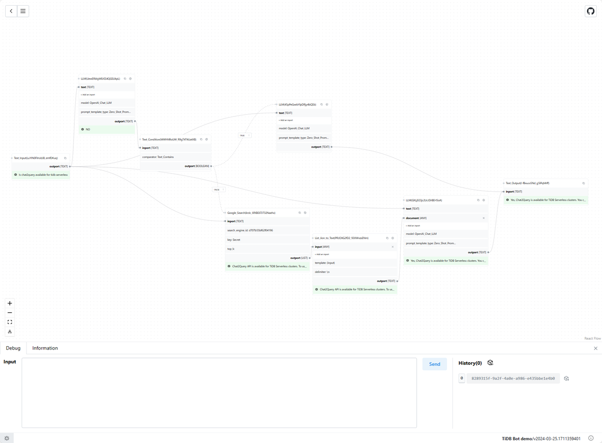
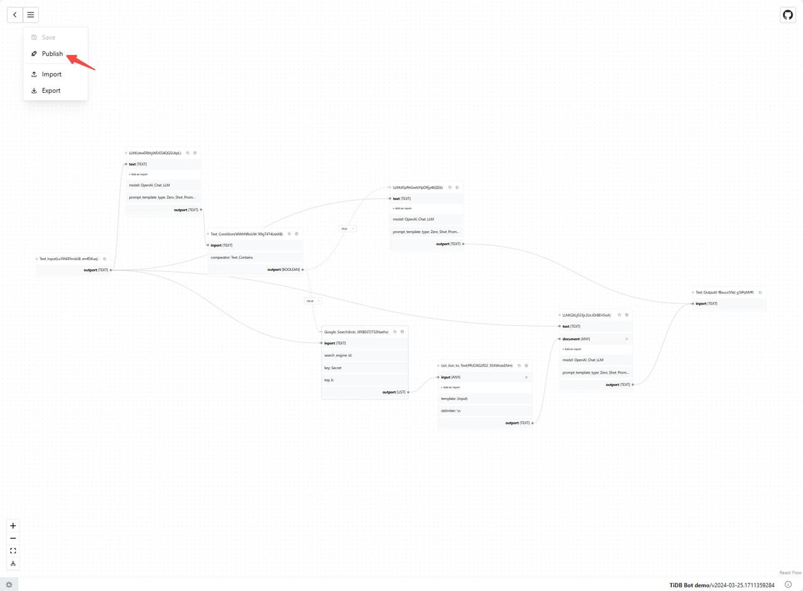
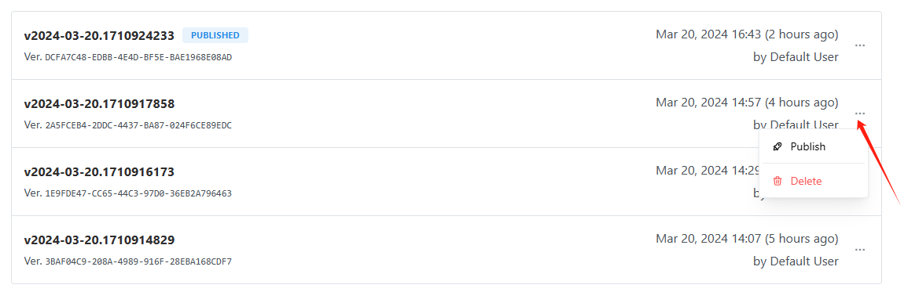

# How to leverage LinguFlow to build and deploy a demonstration of TiDB Bot in 10 minutes

## 1. Prerequisites

### 1.1 What You Need

- Setting up LinguFlow in your local environment
- Getting an OpenAI API key
- Setting up Google custom search API and getting a key
- Better to have
  - Knowledge of Langchain core modules about prompts and models

### 1.2 Limitation

- In this example, we will use `GoogleSearch` block as a simplified retrieval for demonstration.
- This is just a demonstration without chat session management and revision.
- Only LLM from OpenAI is provided now. 

## 2. Designing the Business Logic of TiDB Bot Demonstration

The business logic shows as follows:

- Judge whether the question is related to TiDB
  - If it is not related to TiDB, refuse to answer it politely.
  - Otherwise, retrieve the corpus related to the question and answer it finally

> Notes:
> - Usually the best practice is to use RAG for the judging block and the refusing block too. 

## 3. Building the TiDB Bot Demonstration in LinguFlow

### 3.1 Normal procedure

What you should do is to implement the business logic in the above section block by block according to your intuition.

Or you can do as the following section and read the configuration of each block. 

### 3.2 Substitute  procedure

1. Create a new application and a new version of it

  
  

2. Importing the given YAML file `TiDB_Bot_demo.linguflow.yaml`

  

3. Filling up with OpenAI API key in 3 LLM blocks
4. Filling up with search_engine_id and key in the GoogleSearch block according to the following post Custom Search JSON API
5. Save
   
  

## 4. Testing and Debugging

You can access testing and debugging by clicking the button at the bottom left corner. 

  

Then you can input the testing questions in the input box and get the whole information flow from all valid blocks. You can modify any of them and retry it until you get the proper answer. 

  
  

## 5. Deploying the TiDB Bot Demonstration

When the test result is available, you can publish this version from 2 ways. You can deliver the API to your customer or integrate it into your service. 

  
  

## 6. Conclusion

It is a quick start of a simplified version of a production application. 

It is clear that building applications based on business logic allows for a quicker implementation, debugging, and deployment experience, compared to understanding the construction relationships of entities in the code before organizing the application.

In the future, there will be more usful blocks in this repository. If you have any questions or expectations, please do not hesitate to raise an issue or contact us.